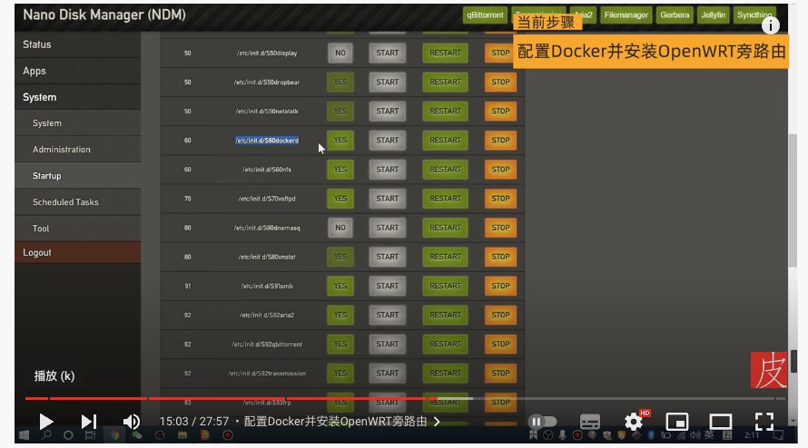
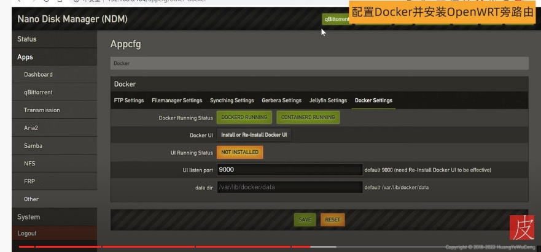
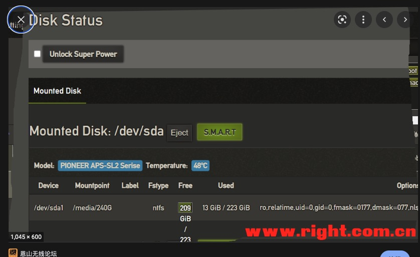
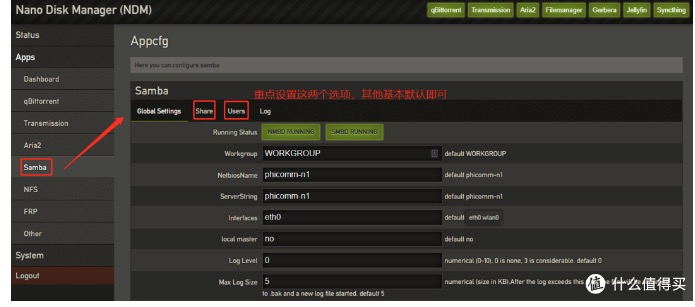
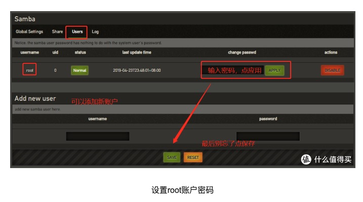
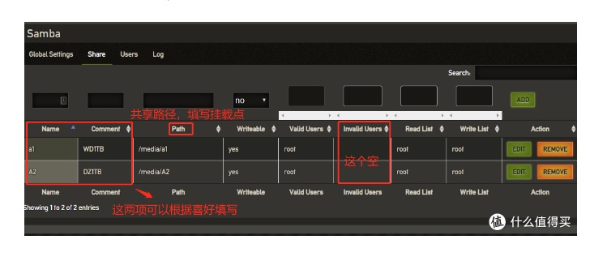
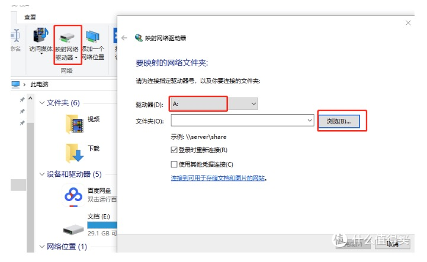

## 背景

最近在拼夕夕上买了一个斐讯N1，用来挂载硬盘做一个简易版的NAS. 


买回来不用刷机折腾，直接接上电源 与 网线 ，外置硬盘 （exfat格式）挂上就能完成硬件配置。

软件配置参考的 [斐讯N1小钢炮系统+Docker安装OpenWrt旁路由/小钢炮PT下载/N1软路由/N1小钢炮系统上手 - YouTube](https://www.youtube.com/watch?v=zpZ81l3FUco&t=20s) 这个视频。

## 软件配置

### 查询IP

    查询 IP 的方法，有很多，比如我用的是 进入路由器的后抬找到带有 N1的设备对应的ip就OK 了，分辨不出来可以插拔 N1 的网线来判断哪个设备消失出现即可分辨出。

### 打开常用的软件

    使用查到的ip就能 进入 N1 里面搭载的 小钢炮系统。




    如图，进入到 System - Startup 里面，把所有能点的 NO 都点成 YES，然后进入 System - Tool 里面，点击 reboot 重启。

#### docker




点击 docker ui 对应的 install ui 按钮。装一个可视化的docker 管理后台。

## 硬盘SMB

进入 Status -  Disks 里，就可以看到 自己挂在的硬盘信息了。


注意 Mountpoint 下的信息 **/media/240G** 的信息，配置SMB的时候需要。

进入 Apps - Samba 里，主要是 Share 与 user 配置项。


user 配置项



share 配置项



注意 图片里，path 参数，设置为 Status -  Disks 中 Mountpoint 下的信息 **/media/240G** 目录或者其子目录。
    
    配置完毕

电脑挂载SMB ，目前所有主流系统的文件管理包括手机都支持此协议挂载。



## Openwrt 旁路由

配合 [视频链接](https://www.youtube.com/watch?v=zpZ81l3FUco&t=883s) 进行配置。

```txt
拉取镜像：docker pull unifreq/openwrt-aarch64:r9.10.1

网卡永久设置混杂模式  vi /etc/rc.local   加入  ip link set eth0 promisc on  重启N1后 ifconfig

创建 Docker 虚拟网络  docker network create -d macvlan --subnet=192.168.2.0/24 --gateway=192.168.2.1 -o parent=eth0 macnet  将 192.168.2 修改为你自己主路由网段

开启 OpenWrt 容器  首先查看已下载镜像：docker images   然后  docker run --restart always -d --name=OpenWrt --network macnet --privileged unifreq/openwrt-aarch64:r9.10.1 /sbin/init

配置 OpenWrt 容器网络  首先N1 ssh连接：输入 docker exec -it OpenWrt bash   然后vi /etc/config/network  将 option ipaddr 192.168.X.1 替换旁路由 IP 地址（如 192.168.8.88）

旁路由添加防火墙 iptables -t nat -I POSTROUTING -j MASQUERADE   并重启防火墙
```