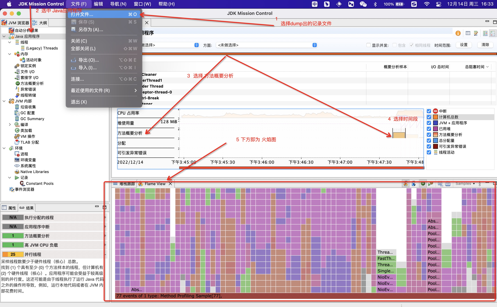
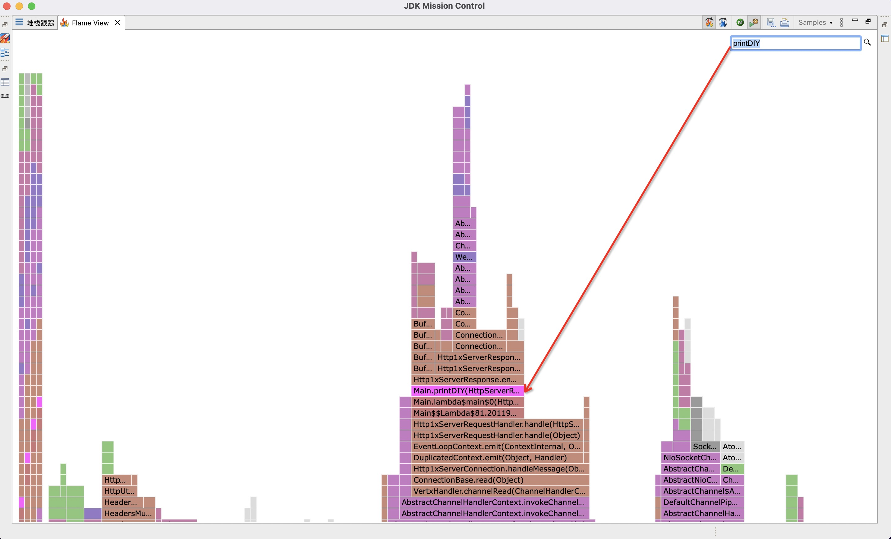

# 准备一个被压程序

这里是有 vertx 新建一个http服务。
## 依赖

```xml
<dependency>
    <groupId>io.vertx</groupId>
    <artifactId>vertx-core</artifactId>
    <version>4.3.6</version>
</dependency>
```

程序代码
```java
package org.example;

import io.vertx.core.Vertx;
import io.vertx.core.http.HttpServer;
import io.vertx.core.http.HttpServerRequest;

public class Main {
    public static void main(String[] args) {
        Vertx vertx = Vertx.vertx();
        HttpServer server = vertx.createHttpServer();
        server.requestHandler(req ->{
            printDIY(req);
        });
        server.listen(8080,res->{
           if(res.succeeded()){
               System.out.printf("Success");
           }else{
               System.out.printf("fail");
           }
        });
    }

    public static void printDIY(HttpServerRequest req){
        req.response().end("dsadsadasdsa");
    }
}
```

# 准备一个压测程序

这里使用 [go-wrk](https://github.com/tsliwowicz/go-wrk)，需要先安装 go 环境，然后执行

```bash
go install github.com/tsliwowicz/go-wrk@latest
```
进入以下文件夹找到bin文件夹里，即可看到 go-wrk程序
```bash
go env | grep GOPATH
```
在这个bin文件夹里即可执行压测程序
```bash
./go-wrk -c 80 -d 5  http://127.0.0.1:8080
# 运行基准测试 5 秒，使用 80 个 go 协程
```

# 使用JFR记录

```bash
jcmd 5311 JFR.start name=jfrdemo maxage=1d maxsize=1g
# 开启 JFR 记录 启动一个名称为 jfrdemo, 最多保留一天，最大保留 1G 的本地文件记录
# Use jcmd 5311 JFR.dump name=jfrdemo filename=FILEPATH to copy recording data to file.
jcmd 5311 JFR.dump name=jfrdemo filename=/Users/topjoy/Desktop/JFRDemo.jfr
# 获取这一段的记录信息
topjoy@TopjoydeMacBook-Pro ~ % jcmd 5311 JFR.stop name=jfrdemo
# 关闭 JFR 记录
```
我们只要在压测结束后 dump出记录文件后关闭即可。

注释，我们也可以使用 [arthas](https://arthas.aliyun.com/doc/jfr.html) 里的 jfr 命令，参数与原理基本一样，这里只是尽可能的少引入依赖才没使用 arthas。

# 下载安装并使用 JMC分析 dump文件
## 安装
[JMC下载后](https://www.oracle.com/java/technologies/javase/products-jmc8-downloads.html)正常安装即可。

## 火焰图查看



find自己写的方法



# JFR

    Java Flight Recorder（JFR)现在可以直接使用类比飞机上的黑匣子.
    jfr不需要在现有应用上添加额外参数、重启进程等，直接在命令行执行即可实时生效，JVM自带功能，稳定可靠不影响线上应用运行。

Java飞行记录器（JFR）是一种收集诊断信息的工具 以及分析关于一个正在运行的Java应用程序的数据。 它被集成到Java虚拟机（JVM）中，几乎不会造成性能开销， 因此，它甚至可以在负荷繁重的生产环境中使用。 当使用默认设置时，内部测试和客户反馈都表明 这种方法对性能的影响还不到1%。 对于某些应用程序，它可以显著降低。 然而，对于短期运行的应用程序（这不是在生产环境中运行的那种应用程序）， 相对的启动和预热时间可以更大， 这可能会影响性能超过1%。 JFR收集有关JVM以及运行在上面运行的Java应用程序的数据。

# JMC

JMC 是一个工具支持本地和远端进程分析，也可以分析本地的jfr文件。里面依靠菜单即可熟悉他的功能不做展开描述。

# 补充

#### 其他火焰图工具

- [arthas](https://arthas.aliyun.com/doc/profiler.html) 可以配合 [async-profiler](https://github.com/jvm-profiling-tools/async-profiler) 方便的生产火焰图 html等格式文件。

- [jvm-tools](https://github.com/aragozin/jvm-tools) 借助 sjk 也可以解析 jfr 文件生成火焰图。

#### 其他的性能分析工具
- mat
- jconsole
- VisualVM
- [jvm-tools](https://github.com/aragozin/jvm-tools)注意看readme .
  - java -jar ./sjk.jar flame -f ./xxx.jfr -o ./appdemo.html
- 等等
# 参考&感谢

https://docs.oracle.com/javacomponents/jmc-5-4/jfr-runtime-guide/about.htm
https://www.baeldung.com/java-flight-recorder-monitoring
https://blog.51cto.com/rongfengliang/3126245
https://github.com/aragozin/jvm-tools
https://github.com/aragozin/jvm-tools